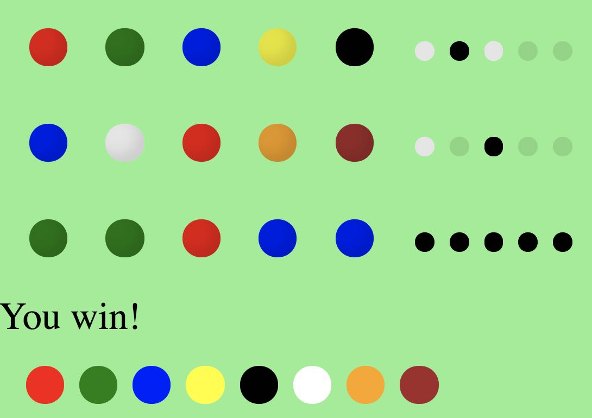

# Mastermind game 🧙‍

A quick and dirty Mastermind single-player game implementation.

https://scmx.github.io/mastermind

The computer opponent decides on a code and you make guesses as to what the code
is. When you've made a guess for all positions on a row, you instantly get the
results and move on to the next row unless you just won. :tada:

## Technologies
- Modern JavaScript (but no transpilation)
- CSS flexbox
- [Hyperapp](https://github.com/hyperapp/hyperapp) - JavaScript
micro-framework with virtual DOM, state management

## References
- https://en.wikipedia.org/wiki/Mastermind_(board_game)

## Gotchas
- Bad UI and UX
- No tests
- Big ugly view component
- No JSX, used `h('div', {}, [...])` instead to try it out :unamused:
- Very cheatable
- Soon to be an intentionally abandoned side project

## Challenges for you
- Write your own version?
- Write a two-player version?
- Move opponent logic to a server to remove ability to cheat?
- Write an isomorphic game server that can be run either in node or in the
  browser?
